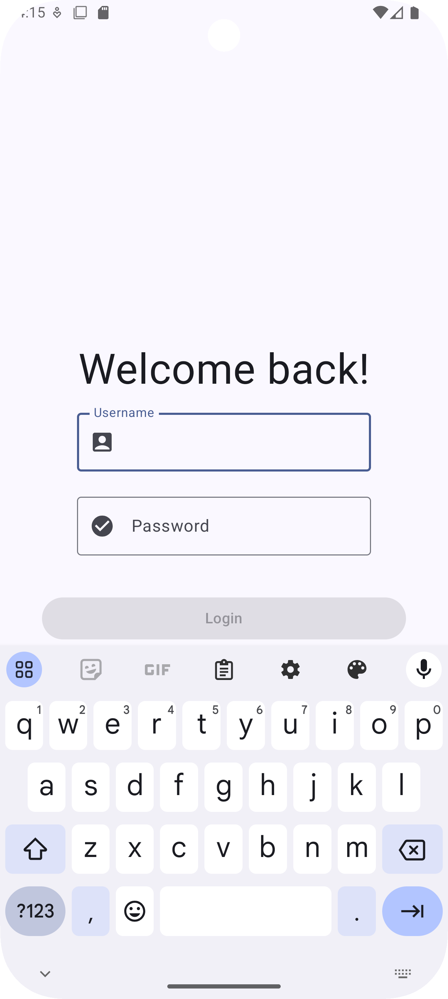
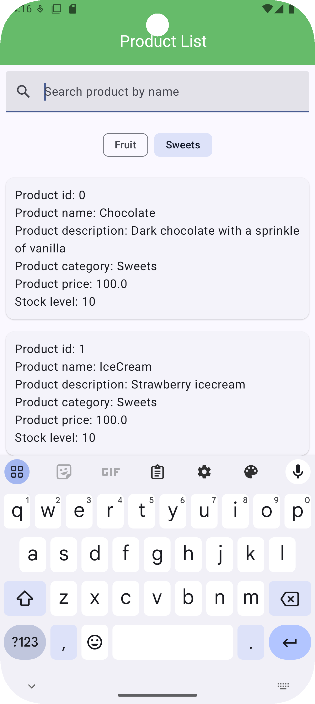
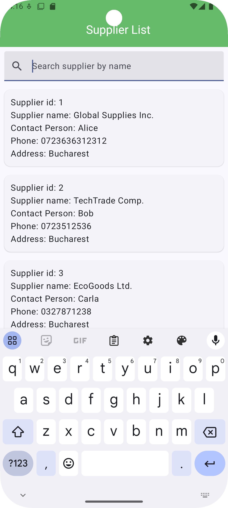
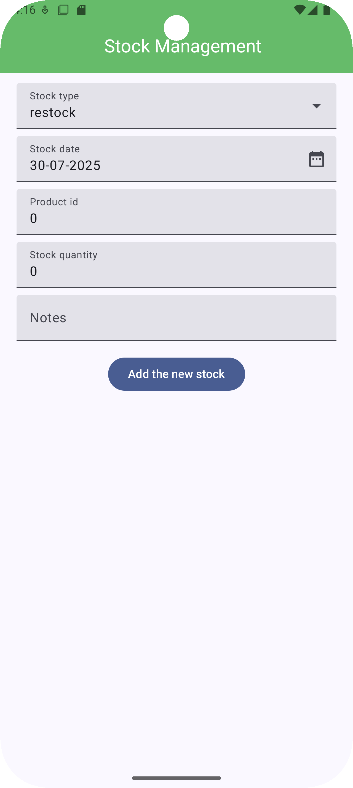

# StockIT app
Stock Management Kotlin application, developed by using Jetpack Compose and ROOM DB, which provides features to add, edit, and track products and suppliers, record sales and restocks, and monitor low stock levels.

## Screens 

   
  
  
   
  

## Implemented features
- [x] User Authentication via the LoginScreen with error handling
- [x] Dashboard: Overview of the low stock items & recent transactions + navigation to the main features
- [x] Transaction History: Record transactions (sale or restock) & filter transactions by type
- [x] Product List Management: View product list details + Filter and search products by category
- [x] Product Detail: View/Edit the current product details
- [x] Add New Product: Record a new product in the database via a specific form
- [x] Supplier List Management: Display all suppliers with search functionality
- [x] Supplier Detail: View and edit supplier information
- [x] Unit tests

## Architecture overview
This project follows a clean MVVM architecture combined with a repository pattern, as it goes:
- Model: For implementing proper DAOs for Room database operations
- Repository: To communicate with/To abstract the data source
- Hilt Dependency Injection: To provide dependencies such as repository and navigator
- ViewModel: It interacts with the repository & it handles the UI logic and the state management by using Flows
- View: The screen composables & UI components, which emit user events back to their viewmodel
- Navigation: It uses a centralized Navigator class, in order to decouple the logic between the UI and the navigation
